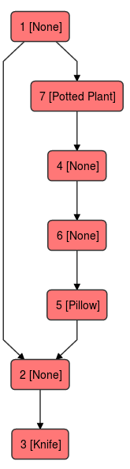

# esercizio
find a route from a root

# Problem
**Given**:
1. a map of connected rooms that have inside them a series of objects
2. a starting room
3. a list of objects to collect

**Find**:

* a possible path to collect all objects given at point 3 in all rooms, starting as root from room at point 2

# Solution

Our problem can be easily categorized into a common graph traversal case; 
in particular our solution is a (non performant) implementation of a dfs [(depth first searching)](https://it.wikipedia.org/wiki/Ricerca_in_profondit%C3%A0).
Briefly it consist in two simple steps:

1. visit a node
2. visit (recursively) all connected nodes to the one at point 1 (but that have not been visited yet) 

Below our implementation

```python
    def traverse(self,root):
        objects_found = root.find_objects(self.objects_to_find)

        index = root.get_id()
        self.visited[index-1] = 1

        r = Route(root,objects_found)
        self.route.append(r)

        #print("visiting node {} ... found {}".format(index, r.get_objects_found()))
        for node in self.my_map.get_neighbors(index):
            node_index = node.get_room().get_id()
            if self.visited[node_index-1]:
                continue
            else:
                self.traverse(node.get_room())
            r_back = Route(root, [])
            self.route.append(r_back)
```

# Limitations
The graph must be connected to reach every nodes, but have you ever seen a room without a door? For our problem, it should be not a problem.

# Data structures

Common mostly used data structures to represent a graph are:

* [adjacency matrix](https://it.wikipedia.org/wiki/Matrice_delle_adiacenze)
* [adjacency list](https://it.wikipedia.org/wiki/Lista_di_adiacenza)

In terms of **memory ocupation** the first (a.m.) is preferible when the most of the nodes are connected to each other, in other terms when the number of links are big. Otherwise, the second (a.l.) is used when the graph is sparse (many nodes but not so much links).

In term of **elaboration time** a.l. have a O(V + E) complexity otherwise a.m. O(V*V). 

With :

1. `V = n. of nodes`
2. `E = n of links`

So even in this case, a.m. is preferible when E is very big and it is important have a costant responding time at the question "Does exist a link from A to B?".

For our problem we have preferred adjacency lists because, according to us, even in a big house is unlikely that the rooms (V) are dense connected to each other and so E ~ V. So our assumptions are V=E and in term of elaboration time O(V+V) < O(V*V).
For the same reason even for memory occupation consideration adjacency lists could be preferred, but we do not think the dimension of our map could be a problem.


# Implementation



* datatype.Room is a room :)
* datatype.Route is a hop (room visited + direction) in a completed route. So a completed route is a list of Route instances
* datatype.Router is the builder of the completed route. It implements dfs.
* datatype.Map is an implementation of a adjacency list. It is a dict of lists: each key in the dict represents an id room and points to a list that holds all the neighbors of that room (that are represented in memory as Node instances, see below). 
* datatype.Node is an element into an adjacency matrix. It is composed by a memory link to a Room and the direction.
* hashrooms is a simple Dict that holds all the memory links to Room instances created by parsing process. So it serves as a db to build Map and Node instances.

```
├── datatype
│   ├── __init__.py
│   ├── map.py
│   ├── node.py
│   ├── room.py
│   ├── route.py
│   └── router.py
├── Dockerfile
├── immagini
│   └── grafo.png
├── main.py
├── map.json
├── parser
│   ├── __init__.py
│   └── parser.py
├── README.md
├── requirements.txt
├── route
│   ├── __init__.py
│   └── router.py
├── scripts
│   ├── build.sh
│   ├── run.sh
│   └── tests.sh
└── test
    ├── datasource
    │   └── map.json
    ├── datatype
    │   ├── test_map.py
    │   ├── test_node.py
    │   ├── test_room.py
    │   └── test_route.py
    └── parser
        └── test_parser.py

```
The graph, in json format, is parsed by Parser instance. It returns a raw_map (dict loaded from json) and hash_rooms (dict of Room instances created from json data).
Using hash_rooms and raw_map an adjacency list is created (Map instance). it holds all the information about every neighbors of all nodes, so it holds information about topology of our map.
With a Map instance, hash_rooms and a list of objects to find a Router is able to find a possible route using dsf.
Finally the results are retrieved and printed.

See below code for details:

```python
def parsing(filename):
    p = Parser(filename)
    p.parse()
    hash_rooms = p.get_hash_rooms()
    raw_map = p.get_raw_map()
    return (raw_map, hash_rooms)

def main(filename,id_root,object_to_find):

    raw_map, hash_rooms = parsing(filename)
    import pdb
    pdb.set_trace()
    my_map = Map(raw_map, hash_rooms)
    root = hash_rooms[id_root]
    router = Router(root, my_map, object_to_find)
    router.get_route()

```


# Usage
 :exclamation: Please insert below command in the root dir of the project that you have cloned

### Help

```
docker run -v $(pwd):/mnt -w /mnt mytest 
usage: main.py [-h] [-f FILENAME] [-i ROOT] [-o OBJECTS [OBJECTS ...]]

find a route from a root!

optional arguments:
  -h, --help            show this help message and exit
  -f FILENAME           your map (json format)
  -i ROOT               your root room id
  -o OBJECTS [OBJECTS ...]

```
### Build

We have nothing to build in python so scripts/build.sh is used to build docker image

```
/scripts/build.sh 
```
### Run

Find your route

```
docker run --name mytest -v $(pwd):/mnt -w /mnt mytest ./scripts/run.sh -f map.json -i 1 -o Pillow,Knife,"Potted Plant"
```

### Test

Some test

```
docker run --name mytest_pytest -v $(pwd):/mnt -w /mnt mytest ./scripts/tests.sh

```

